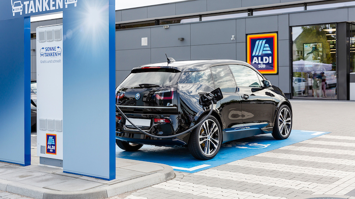
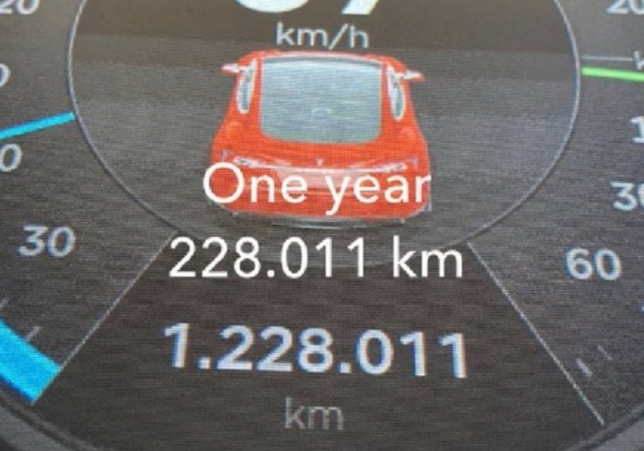
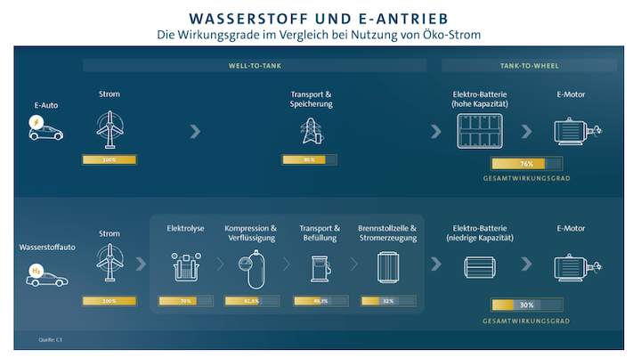
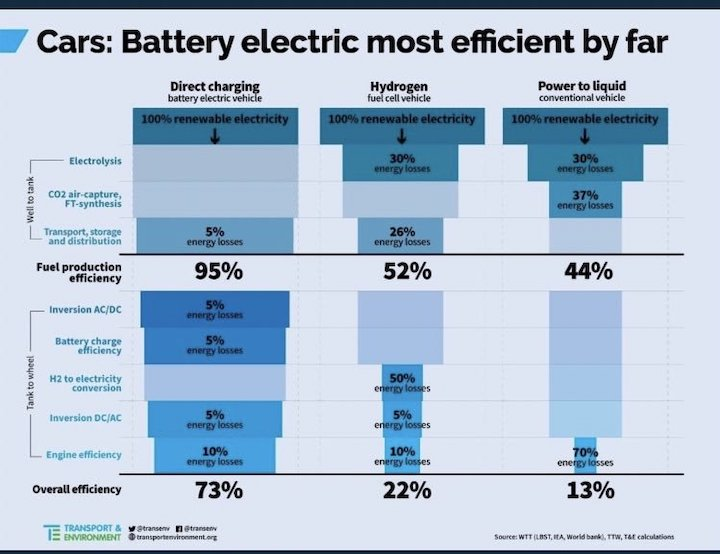

# Vorurteile & Mythen beim E-Auto
* Autor: Christian Menschel 
* Stand: Dezember 2020

Wenn es um E-Autos geht, scheiden sich die Geister: Die einen begrüßen mit Begeisterung die neue Antriebstechnologie. Die Anderen reagieren überaus skeptisch und lehnen sie ab. Gründe gibt es viele. Einer liegt in der Berichtserstattung der populären Leitmedien. Häufig wird dort nicht zwischen wirklichen und vermeintlichen Fakten sowie Vorurteilen klar unterscheiden, sodass es schwer ist, sich eine objektive Meinung zu bilden. Mit ein paar Mythen und Vorurteilen möchte ich aufräumen, so dass jeder auf Basis der aktuellen Erkenntnisse die Option hat, sich selbst eine eigene Meinung zu bilden.
## 1. Das Laden dauert ewig
Beim Laden müssen die Einsatzzwecke des E-Autos unterschieden werden. Durchschnittlich legt ein Mensch in Deutschland eine Strecke von [39 Kilometer pro Tag zurück](https://www.bmvi.de/SharedDocs/DE/Anlage/G/mid-2017-kurzreport.pdf?__blob=publicationFile). Es reicht also in den meisten Fällen aus, wenn das Auto über Nacht langsam mit Wechselstrom (AC) an einer Ladesäule oder zu Hause an einer Steckdose geladen wird. Ungefähr 1/3 der Deutschen leben in einem [Einfamilienhaus]((https://www.faz.net/aktuell/finanzen/meine-finanzen/sparen-und-geld-anlegen/immobilien-hausbesitzer-bleiben-in-deutschland-in-der-minderheit-16143807.html)) und können somit bequem zu Hause zu laden.
Das E-Auto ändert die Art des „Tankens“. Es wird in den Parkvorgang integriert, sodass jeder Besuch eines Geschäfts, Museums oder Bekannten direkt zum Laden genutzt werden kann. Wenn der Arbeitgeber Ladesäulen anbietet, kann auch dort aufgeladen werden, sodass die Ladezeit im Alltag eine untergeordnete Rolle spielt und die Zeit an der Tankstelle entfällt. Eine weitere Möglichkeit bieten viele Supermärkte, die heute Ladesäulen, sogar oft kostenlos (z.B. [Kaufland](https://unternehmen.kaufland.de/presse/pressemitteilungen/pressemitteilungen-detail.y=2019.m=02.n=hundertste-schnellladestation-fuer-elektroautos.html), [LIDL oder IKEA](https://www.auto-motor-und-sport.de/tech-zukunft/alternative-antriebe/gratis-strom-angebot-ladesaeulen-supermarkt-baumarkt/)), [auf den Parkplätzen anbieten](https://ecomento.de/2020/09/04/aldi-sued-will-elektroauto-ladenetz-bis-2024-deutlich-ausbauen/). In wenigen Jahren wird es vermutlich keinen großen Parkplatz mehr ohne Ladeplätze geben.

(Abb. Aldi Süd)

Für längere Fahrten und Langstrecken stehen Schnellladesäulen - [High Power Charging (HPC)](https://www.all-electronics.de/elektromobilitaet-high-power-charging-in-der-praxis/) - an Autobahnen mit Gleichstrom (DC) von 100 bis 350 kW (z.B. europaweit bei [Ionity](https://ionity.eu/de)) zur Verfügung. Das heißt bei einem [VW ID.3](https://www.volkswagen.de/de/modelle-und-konfigurator/id3.html) (maximale Ladeleistung 125 kW): Innerhalb von 30 Minuten können 290 bis 350 Kilometer nachgeladen werden. Bei einem Tesla [Model 3](https://www.tesla.com/de_de/model3) reichen sogar 15 bis 25 Minuten für die selbe Strecke. Zukünftig werden E-Autos sogar bis 350 kW laden können, sodass dann theoretisch 500 Kilometer in 15 Minuten möglich sind.

(Abb. Quelle [ecomento](https://ecomento.de/2020/10/08/fastned-tesla-seed-greet-schnellladepark-hilden-eroeffnung/), Größter Ladepark Deutschlands in Hilden gebaut von [Bäcker Schüren](https://www.ihr-bäcker-schüren.de/Ladepark.htm))

Schnellladesäulen, die ständig weiter ausgebaut werden (z.b. [EnBW](https://www.enbw.com/elektromobilitaet/ausbau-schnellladenetz), sind einfach zu finden: Bei einigen E-Autos (z.B. Tesla) übernimmt das Navigationssystem die Suche der Ladestationen direkt bei der Zieleingabe und integriert diese in die Route. Alternativ dazu sind Apps ([chargeEV](https://ev-freaks.com/de/chargev/) oder „[A Better Routeplanner](https://abetterrouteplanner.com)") verfügbar, die alle Lademöglichkeiten - ob schnell (DC) oder langsamer (AC) - anzeigen und Routenplanungen mit Berechnung der Ladestopps ermöglichen. Neben dem gut ausgebauten Tesla-Ladenetz (Supercharger), gibt es mittlerweile auch für andere Marken ausreichende Möglichkeiten zum Schnellladen an Rasthöfen (Anbieter: Ionity, EnBW, Fastned, Allego und E.ON).
Auf einer Langstreckenfahrt (> 500 Kilometer) kommt man am schnellsten voran, wenn das E-Auto von 5 bis 80 Prozent Akkustand gefahren wird. Die Leistung beim Laden ist nicht konstant. Die meisten E-Autos erreichen die höchste Ladeleistung, wenn der Akkustand bei 5 bis 50 Prozent liegt. Das Laden ab 80% Akkustand dauert im Verhältnis zu lang, sodass sich hier das Warten oft nicht lohnt und besser ein zweiter kurzer Stopp eingelegt werden kann.     
Ich bin mit meinem Tesla Model 3 von der Region Aachen nach Frankreich, in die Schweiz oder Italien gefahren. Ich hatte nie Angst stehen zu bleiben, habe immer eine Schnellladesäule gefunden und konnte ohne Probleme das Laden mit anderen Aktivitäten verbinden. Und wenn es der Einkauf beim Supermarkt während des Ladenvorgangs war.

## 2. E-Autos haben ein Problem mit der Reichweite
Die Reichweiten der E-Autos kommen immer mehr in die Nähe der Benziner oder Diesel. Reale Reichweiten Stadt und Autobahn kombiniert:
* [VW ID.3 ID.3 Pro S](https://ev-database.de/pkw/1203/Volkswagen-ID3-Pro-S) - 380 Kilometer (Winter) bis 520 Kilometer (Sommer)
* Tesla [Model 3 Long Range](https://ev-database.de/pkw/1321/Tesla-Model-3-Long-Range) 400 Kilometer (Winter) bis 550 Kilometer (Sommer)
* Renault [Zoe R135 Z.E. 50](https://ev-database.de/pkw/1205/Renault-Zoe-R135-ZE-50) 260 Kilometer (Winter) bis 355 Kilometer (Sommer)

Auch hier gibt es laufend Entwicklungen, die die Reichweite betreffen. Auf dem Battery-Day im September 2020 hat Tesla die nächste Generation von eigenen Lithium-Ionen-Batterien (4680)  [vorgestellt](https://www.auto-motor-und-sport.de/tech-zukunft/tesla-battery-day-neue-zellen-kosten-halbiert/), die in wenigen Jahren verfügbar sein sollen. Mit den neuen Batterien soll eine Reichweitensteigerung um mehr als 50 Prozent und eine Reduzierung von 56 Prozent der Batteriekosten möglich sein. Mit Teslas neuen Batterien oder auch mit [Feststoffbatterien](https://www.auto-motor-und-sport.de/tech-zukunft/alternative-antriebe/feststoffbatterien-nachfolger-lithium-ionen-elektroauto/) könnten in wenigen Jahren E-Autos mit 1.000 Kilometer Reichweite möglich sein, und das mit einer Kostenreduzierung bei der Batterieproduktion.
Auf meinen längeren Fahrten muss ich häufiger Pausen für persönliche Bedürfnisse - alle 200 bis 300 Kilometer - einlegen, als zum Aufladen des Akkus notwendig sind. Somit habe ich nie die Notwendigkeit die maximale Reichweite (bei mir rund 500 Kilometer) vollständig nutzen zu müssen. Theoretisch würde sogar ein kleinerer Akku für meine Fahrten reichen.
Eine gute Übersicht aktueller E-Autos mit Angaben zu Reichweiten, Ladezeiten und Verbräuchen bietet: [ev-database](https://ev-database.de) oder [mobilityhouse](https://www.mobilityhouse.com/de_de/ratgeber/ladezeitenuebersicht-fuer-elektroautos)

## 3. Zu wenig Ladesäulen
In Deutschland gibt es (Stand Nov. 2020) circa [33.000 öffentliche Ladepunkte](https://ecomento.de/2020/11/17/33107-oeffentliche-elektroauto-ladepunkte-in-deutschland-bdew/). Im Vergleich dazu gibt es [14.500 Tankstellen](https://www.handelsdaten.de/branchen/tankstellen) in Deutschland. Auch wenn bereits heute vielfältige Optionen zur Verfügung stehen, reicht es für die Zukunft nicht aus. Das Ziel sind [eine Million öffentliche Ladepunkte bis 2030](https://www.bundesregierung.de/breg-de/themen/klimaschutz/ladeinfrakstruktur-1692644), was eine 30 fache Steigerung zu heute wäre. Hier besteht durchaus Nachholbedarf in Deutschland. Hinzu kommt leider, dass es beim Ausbau der öffentlichen Ladesäulen in Deutschland erhebliche Unterschiede gibt. Während Hamburg circa 2.400 Ladepunkte zum öffentlichen Laden bietet, hat Köln nur 420 Ladepunkte (Stand nov. 2020, Quelle [goingelectric.de](goingelectric.de)). Außerdem muss dringend das Bezahlsystem beim Laden vereinfacht und vereinheitlicht werden. Aktuell gibt es noch ein Tarif Wirrwarr mit verschiedenen Karten zum Zahlen an öffentlichen Ladepunkten. Abhilfe schafft hier der emobly [Ladekarten-Kompass](https://emobly.com/de/category/laden/ladekarten-kompass/). Das Gute ist: Beim Laden hat das E-Auto einen erheblichen Vorteil gegenüber dem Verbrenner oder dem Wasserstoffauto. Strom gibt es eigentlich überall. Sogar [Straßenlaternen](https://www.hannover.de/Service/Presse-Medien/Hannover.de/Aktuelles/Wirtschaft-Wissenschaft-2020/Strom-aus-der-Laterne-neue-E-Ladesäulen-in-Langenhagen) können als Ladesäule dienen. Auch die Supermärkte (Aldi, Lidl, Rewe) bauen die Lademöglichkeiten weiter aus. Auch [McDonald's möchte](https://emobly.com/de/news/ewe-und-mcdonalds-starten-ladesaeulen-offensive-in-deutschland/) mehr als 1.000 Standorte bis 2025 mit mindestens einem Schnelllader (HPC) ausstatten.

## 4. Nur für die Stadt geeignet
Im Gegensatz zum Verbrenner, der in der Stadt und bei kurzen Fahrten einen [schlechten Wirkungsgrad](https://www.springerprofessional.de/motorentechnik/pkw-antriebe-im-ueberblick-vergangenheit-gegenwart-und-zukunft/6561052) hat, benötigen E-Autos in der Stadt weniger Energie als auf Autobahn-Fahrten und belasten dabei die Städte nicht mit Schadstoffen. Aktuell sind in den Städten pro Quadratkilometer mehr Ladesäulen als in ländlichen Regionen vorhanden. Auf dem Land wohnen dafür Menschen mehr in Häusern und können dort direkt am eigenen Haus laden. Im Prinzip ist jedes Haus in Europa ausreichend mit Strom versorgt, um ein E-Auto aufladen zu können. Selbst eine einfache Steckdose genügt im Notfall zum Laden. Außerdem geht der Ausbau von Ladepunkten an [Supermärkten](https://teslamag.de/news/enbw-offensive-ladesaeulen-bau-und-supermaerkte-elektroauto-strom-zuhause-31195) oder von [Schnellladestationen](https://www.electrive.net/2019/06/26/ionity-jeden-zweiten-tag-ein-neuer-ladepark/) voran.

## 5. Akku hält nicht lang bzw. verliert wie beim Handy nach 2 Jahren die Kapazität
Die Akkus von E-Autos halten deutlich länger als bisher vermutet oder wie einige [“Studien” angenommenen](https://www.spiegel.de/auto/aktuell/e-auto-schlechtgerechnet-die-ifo-studie-zur-co2-bilanz-a-1263622.html) hatten (150.000 Kilometer). Die Akkus vom E-Auto werden im Vergleich zum einfachen Handy mit einem speziellen Lade-System ([BMS](https://de.wikipedia.org/wiki/Batteriemanagementsystem)) überwacht, gekühlt, gewärmt und somit schonender geladen. Gerade der Einsatz eines [Thermomanagements](https://www.mahle.com/de/products-and-services/emobility/thermomanagement/) (Kühlung im Sommer oder Aufwärmen im Winter) verlängert die Lebenszeit des Akkus. Forscher haben im Oktober 2020 Ergebnisse von Tests mit Tesla-Akkus vorgestellt, aus denen hervorgeht, dass Tesla Akkus mit einer Lebensdauer von mehr als 10.000 Zyklen - bzw. [3,5 Millionen Kilometer](https://futurezone.at/produkte/neuer-tesla-akku-soll-35-millionen-kilometer-halten/401069763) - möglich sind. Auch in der Praxis gibt es Beispiele, die diese Zahlen belegen. Der Tesla Fahrer Hansjörg-Eberhard Freiherr von Gemmingen-Hornberg hat mit seinem Tesla (älteres Model S) [über 1,2 Millionen Kilometer](https://www.spiegel.de/auto/aktuell/tesla-extremfahrer-eine-million-kilometer-im-elektro-a-1298740.html) zurückgelegt. Der Akku wurde einmal bei 290.000 Kilometern auf Garantie getauscht. Seit dem fährt er fast eine Millionen Kilometer mit dem selben Akku.

(Abb. Hansjörg von Gemmingen @gem8mingen)

Tesla [verspricht beim Model 3 1.500 Ladezyklen](https://twitter.com/elonmusk/status/1117099861273219073) eines Akkus, was eine Gesamtdistanz von 500.000 bis 800.000 Kilometer entspricht und auch Lexus bietet für sein neues elektrisches Auto UX 300e eine [Garantie von einer Million Kilometer](https://www.auto-motor-und-sport.de/fahrbericht/lexus-ux-300e-elektro-crossover/).
Ein Akku kann für mehrere Autoleben genutzt werden, ohne die Akkus recyceln und neu bauen zu müssen. Das senkt Kosten und verbessert den ökologischen Fußabdruck. Wenn die Batterie im Auto aufgrund nachlassender Leistung ausgedient hat, kann sie immer noch ein zweites Leben (“Second-Life”) in Gebäuden als Pufferspeicher für Strom aus der Sonne (Photovoltaik) antreten. Dies wurde bereits 2018 erfolgreich für das [Amsterdamer Stadion umgesetzt ](https://www.electrive.net/2018/07/02/amsterdam-arena-versorgt-sich-mit-3-mw-speicher/).

## 6. E-Autos sind langsam und machen keinen Spaß
Dieser Mythos ist schnell widerlegt, wenn man einmal selbst ein E-Auto gefahren ist. Es fährt leise und stufenlos an (keine Schaltvorgänge), bremst von selbst beim Wegnehmen vom Strompedal (Rekuperation = Energiegewinnung). Der Fahrer oder die Fahrerin gleitet bequem mit einem Pedal durch den Verkehr. Das Bremspedal wird nur in Ausnahmefällen benötigt. Das Fahren ist entspannter und vorausschauender als mit einem Verbrenner. Wenn es doch mal schnell gehen soll:
* Der Tesla Model S Plaid schafft es in [2,1 Sekunden von 0-100 km/h](https://www.auto-motor-und-sport.de/elektroauto/tesla-model-s-plaid-2021-reichweite-technik-preise/)
* Der BMW i3 braucht [7,3 Sekunden](https://www.auto-motor-und-sport.de/test/bmw-i3-94-ah/technische-daten/)
* Audi E-Tron braucht [5,5 Sekunden](https://evchargeplus.com/de/fastest-electric-cars/)
* VW ID.3 braucht [7,3 Sekunden](https://www.adac.de/rund-ums-fahrzeug/autokatalog/marken-modelle/vw/vw-id-3/)

Aber das eigentlich Schöne beim Fahren eines E-Autos ist, dass man aufgrund der Ruhe viel entspannter unterwegs ist.

## 7. E-Autos kosten zu viel
Vor zehn Jahren waren E-Autos noch ziemliche Exoten auf den Straßen. Ab 2013 kam Tesla mit dem Model S auf dem Markt und bot zum ersten Mal E-Autos mit hoher Reichweite an, die jedoch anfangs ziemlich teuer waren. Ab 2019 ist in Deutschland das günstigere Tesla Model 3 verfügbar, das bei vergleichbarer Ausstattung sogar günstiger als ein Mercedes C-Klasse oder BMW 3er ist. Neben Tesla kamen in den letzten Jahren noch viele weitere gut bezahlbare E-Autos auf dem Markt (bei allen Preisen wurde die Förderung von 9.000 EUR schon abgezogen) :
* [Renault Zoe](https://www.auto-motor-und-sport.de/elektroauto/renault-zoe-2020-mehr-reichweite-mehr-leistung-gleicher-preis/) das meistverkaufte E-Auto in Deutschland beginnt bei 20.000 Euro (Reichweite 200 bis 355 Kilometer)
* [Kia e-Niro](https://www.kia.com/de/modelle/e-Niro/entdecken/#/) ab circa 25.000 EUR (Reichweite 280 bis 455 Kilometer)
* [Škoda Enyaq](https://www.skoda-auto.de/modelle/enyaq-iv/enyaq-iv?gclid=Cj0KCQiA5vb-BRCRARIsAJBKc6JyhQYzfIc9N9DiIgaT1FCOIttyOdVcyz4hMMLlj3TdOT6tYyayJTUaAnnpEALw_wcB&gclsrc=aw.ds) ab circa 29.000 EUR (Reichweite 400 bis 510 Kilometer)
* [Volkswagen ID.3](https://www.volkswagen.de/de/modelle-und-konfigurator/id3.html?---=%7B%22modelle-und-konfigurator_id3_sectiongroup_7331634_featureappsection%22%3A%22%2F%2B%2F0%22%7D#MOFA) ab circa 25.000 EUR (Reichweite 250 bis 550 Kilometer)

Aber auch Kleinwagen für weit unter 20.000 Euro sind nun bald verfügbar. Der VW eUp, Skoda Citigo oder Seat MII sind theoretisch für 11.000 Euro (mit Förderungen) zu kaufen, leider sind diese auf lange Sicht ausverkauft. Aber VW hat hier neue günstigere Modelle - z.B. der ID.2 für 20.000 Euro (vor Förderung) [angekündigt](https://www.manager-magazin.de/unternehmen/autoindustrie/vw-id-2-volkswagen-plant-billiges-elektroauto-a-b2a1a574-121a-4c72-9b7a-b62f0e1c0181).
Jetzt gegen Ende des Jahres 2020 werden mehr E-Autos im günstigeren Preissegment angeboten. Da wären z.b.
* [Opel Corsa-e](https://www.auto-motor-und-sport.de/fahrbericht/opel-corsa-e-fahrbericht/) für circa 20.000 Euro (mit Förderung) und bis 330 Kilometer Reichweite
* [Peugeot E-208](https://www.peugeot.de/modelle/alle-modelle/neuer-peugeot-208/neuer-e-208.html) für circa 21.000 Euro (mit Förderung) und bis 340 Kilometer Reichweite
* Fiat bietet beim [500e](https://www.auto-motor-und-sport.de/fahrbericht/fiat-500e-cabrio/) verschiedene Modelle (Reichweiten von 200 bis zu 350 Kilometer) zu einem Preis ab 14.560 Euro (mit 9.000 Euro Förderung).

Neben den Anschaffungskosten fallen bei einem Verbrenner höhere laufende Kosten als bei einem E-Auto an. Zusätzlich sind E-Autos für die nächsten Jahre von der KFZ-Steuer befreit. Weil beim E-Auto Dinge wie Kupplung, Öl, Getriebe, Auspuff, Katalysator oder Zündkerzen haben nicht mehr existieren, sind Reparaturen und Wartungen günstiger. Bremser halten beim E-Auto auch wesentlich länger. Somit sind kostspieligen Inspektionen beim E-Auto Geschichte. Eine einfache Modell-Rechnung (VW ID.3 und VW Golf TSI mit etwa ähnlicher Ausstattung) gerechnet über 5 Jahre und 75.000 Kilometer:
|                           | ID.3 Pro mit 58 kWH  (circa 380 KM Reichweite)                  |                       Golf (1.0 TSI 110 PS, 6 Gang, VW Code VPTM8JYM)                      |
|---------------------------|-----------------------------------------------------------------|:-------------------------------------------------------------------------------:|
| Kaufpreis                 | 34.112,77 Euro                                                  |                                  23.843,37 Euro                                 |
| Förderung                 | 9.000 Euro                                                      |                                                                                 |
| Steuern                   |                                                                 |                                     330 Euro                                    |
| Sonstige Kosten           |                                                                 | Bremsen circa 1000 Euro                                                         |
| Sprit / Strom (75.000 KM) | circa 3150 Euro (0,30 Euro/kWh und bei 14 kWh/100 KM Verbrauch) | circa 5600 Euro (bei 1,25 Euro/Liter und 6 Liter/100 KM Durchschnittsverbrauch) |
| Gesamt (nach 5 Jahren):   | circa 28.262 Euro                                               | circa 30.700 Euro                                                               |

Kosten für Inspektionen sind nicht berücksichtigt, da diese für den ID.3 noch nicht bekannt sind. Erwartbar sind geringere Service-Kosten als beim Golf.

## 8. Elektro-Autos als Dienstwagen
Mit der Reduzierung der Versteuerung für die private Nutzung eines Dienstwagens (1% Regel) für E-Autos auf bis zu 0,25% bietet das Elektroauto als Firmenwagen einen finanziellen Vorteil gegenüber dem Verbrenner. ArbeitnehmerInnen zahlen für die private Nutzung des E-Autos einen reduzierten Steuersatz von 0,25% auf den Bruttolistenpreis. Bedingung für die Reduzierung ist, dass die günstigste verfügbare Ausführung weniger als 40.000 Euro kostet (z.B. VW ID.3). Beginnt das Modell bei 40.000 Euro (z.B. Audi e-tron) liegt die Versteuerung bei 0,5% des Bruttolistenpreises. Verbrenner werden weiterhin mit 1% versteuert. Das bedeutet oft einige Hundert Euro mehr an Nettolohn pro Monat für die ArbeitnehmerInnen. Bedenkt man, dass gerade die größeren und somit verbrauchsintensiveren Modelle - vor allem SUV - der deutschen Marken als Dienstwagen gefahren werden, die auch den Gebrauchtmarkt über Jahre bestimmen, kann hier ein erheblicher Beitrag zur Reduzierung der CO2-Emissionen geleistet werden. Zusätzlich kann die Firma dank Förderungen ([Link](https://www.co2online.de/foerdermittel/liste/einbau_ladesaeule/), [Link](https://www.mobilityhouse.com/de_de/ratgeber/foerderung-fuer-elektroautos-und-ladestationen), [Link](https://www.elektromobilitaet.nrw/unternehmen/foerderung-fuer-unternehmen/)) kostengünstig Ladesäulen für die Mitarbeiten aufstellen lassen. Viele Firmen bieten dies bereits kostenlos für Ihre MitarbeiterInnen an. Die E-Mobilität senkt für die Firmen nicht nur Betriebskosten (z.B. Benzin oder Diesel), sondern auch den CO2-Fußabdruck des Unternehmens, der MitarbeiterInnen und des späteren  Gebrauchtmarktes, wo die Autos nach 3 bis 4 Jahren erscheinen.

## 9. Das Stromnetz bricht zusammen, wenn alle E-Autos abends laden
Zur Netzauslastung mit E-Autos hat das Energie-Unternehmen EnBW im Jahr 2019 eine Simulation [durchgeführt](https://www.netze-bw.de/e-mobility-allee). Das Ergebnis: Es besteht keine “Blackout” Gefahr. Zum Einen werden nicht innerhalb von 5 Jahren alle Verbrenner durch E-Autos ersetzt - was schön wäre - und zweitens müssen nicht alle Autos gleichzeitig laden. Mit der heutigen Netzstruktur sind etwa 13 Millionen Elektroautos machbar. Das entspricht einem Anteil von [30 Prozent aller Autos in Deutschland](https://www.manager-magazin.de/unternehmen/energie/elektroauto-keine-blackout-gefahr-fuer-die-stromnetze-a-1280563.html). Wenn die Anzahl an E-Autos weiter steigt, können die Energieversorger das Stromnetz entsprechend erweitern. Das ist für sie keine große Herausforderung sondern Alltagsgeschäft.
Fun fact: Früher gab es die stromfressenden Nachtspeicheröfen in Deutschland, die in der Spitze eine ähnliche Leistung benötigten wie eine Ladesäule für E-Autos. Hier sind auch keine Netze zusammengebrochen.
Wer zur intelligenten Stromsteuerung beitragen will, installiert zum Laden des E-Autos eine „smarte" Wallbox der neuesten Generation:
Sie bietet mehr Leistung (11 kW) als eine normale Steckdose
und kann vom Stromanbieter gesteuert werden, womit eine Überlastung verhindert werden kann. Zusätzlich werden diese steuerbaren Ladeeinrichtungen seit November 2020 mit [900 Euro gefördert](https://www.kfw.de/inlandsfoerderung/Privatpersonen/Bestehende-Immobilie/Förderprodukte/Ladestationen-für-Elektroautos-Wohngebäude-(440)/).
Weiterhin gibt noch es regionale und [lokale Förderprogramme](https://www.autobild.de/artikel/wallbox-foerderung-zuschuss-18418135.html). Die Förderung deckt teilweise bis zu 100 Prozent der Kosten ab.

**Meine persönliche Erfahrung:** Ich habe eine recht schwache Stromanbindung in Belgien (nur mit 30 A abgesichert), aber trotzdem kann ich ohne Sorgen den Tesla über Nacht mit 3,7 kW (etwas mehr als eine normale Steckdose) für 250 bis 300 Kilometer laden.

## 10. E-Autos sind zu leise und eine Gefahr für den Verkehr
Oft hört man, dass E-Auto eine Gefahr für Fußgänger darstellen, weil sie zu leise seien. Auch moderne Benziner sind bei niedrigen Geschwindigkeiten sehr leise. FußgängerInnen oder FahrradfahrerInnen sollten sich im öffentlichen Straßenverkehr nie auf Geräusche verlassen. Auch FahrradfahrerInnen bewegen sich geräuschlos im Straßenverkehr und könnten eine Gefahr darstellen. Die Probleme des Straßenverkehrs lassen sich nicht durch Geräusche beheben. Im Gegenteil: Der Lärmbelastung von Autos in den Städten ist für die dort wohnenden Menschen eine erhebliche Beeinträchtigung der [Lebensqualität und hat gesundheitliche Folgen](https://www.umweltbundesamt.de/themen/verkehr-laerm/verkehrslaerm/strassenverkehrslaerm#gerauschbelastung-im-strassenverkehr).

## 11. Weniger Reichweite im Winter
Ein Lithium-Ionen-Akku hat unter Kälte (ab ungefähr 7 Grad und darunter) weniger Leistungsvermögen, was sich negativ auf die Reichweite auswirken kann. Bei starker Kälte wird die Kapazität des Akkus vor allem zum Schutz etwas eingeschränkt. Die Heizung für den Innenraum eines E-Autos wird mit dem Strom des Akkus betrieben. Beim Verbrenner wird hingegen die Abwärme des Motors verwendet. Mein eigenes Tesla Model 3 (2019) hat im Winter einen Mehrverbrauch von circa 20% bis 30%. Für  höhere Reichweiten im Winter werden heutige Modelle - auch die neuen Tesla Model 3 und Model Y - mit [Wärmepumpen](https://www.volkswagen.de/de/elektrofahrzeuge/id-technologie/waermepumpe.html), die der Erwärmung des Akkus und des Innenraums dienen, ausgestattet. Wenn die Kälte wirklich ein großes Problem für das E-Auto darstellen würde, dann wäre das spätestens in Ländern mit einem kalten Winter - Schweden oder Norwegen - zum Hindernis für den Erfolg des E-Autos geworden. Realität ist, dass in Norwegen die Elektromobilität längst Alltag ist und aktuell 60% der Neuwagen [Stand: November 2020, [Quelle](https://businessportal-norwegen.com/2020/11/02/elektroautos-in-norwegen-mit-einem-anteil-von-608-prozent-an-den-neuzulassungen-im-oktober-2020/)] rein elektrisch sind.

## 12. “Wenn du mit einem E-Auto im Stau stehst, ist die Batterie bald leer”
Ein E-Auto benötigt im Stand oder im Stop & Go deutlich weniger Energie als ein Verbrenner. Somit ist die Angst vorm liegen bleiben mit leerem Akku unbegründet. Der Verbrenner hat seinen optimalen Wirkungsgrad bei konstanten Geschwindigkeiten in höheren Gängen. Da dies im Stau nicht der Fall ist, kann theoretisch auch der Benzintank im Stau schneller leer gehen als so mancher denkt. In Norwegen gibt es [E-Auto Fahrer](https://www.youtube.com/watch?v=T_4jFc4hkNk), die 48 Stunden oder länger im Winter mit laufender Heizung bei -20 Grad Außentemperatur im Tesla campen. Das wäre mit dem Verbrenner nur mit laufendem Motor oder teurer Standheizung möglich.
Weitere Vorteile bieten sich im Sommer: Dort lässt sich per App vorm Einstieg die Klimaanlage des Autos einschalten. So kann man direkt mit angenehmen 20 Grad losfahren. Das ist nur eine von vielen bequemen Funktionen, die beim Verbrenner nur mit laufendem Motor möglich wäre.

## 13. Das E-Auto ist gar nicht so sauber
”Das E-Auto ist gar nicht so sauber! Kobalt steht für Kinderarbeit, Lithium = Austrocknung. Also kann ich meinen Verbrenner weiter fahren!”
Lithium, Kobalt und viele andere problematische Rohstoffe werden seit Jahrzehnten unter teilweise furchtbaren Bedingungen für Mensch und Umwelt abgebaut, weil wir sie im Alltag brauchen: ob für Handys, Laptops, Flugzeuge oder in Verbrenner-Autos als Katalysator oder Rußpartikelfilter.
Wer also auf technische Produkte, das Fliegen oder das Auto insgesamt verzichtet, hat mehr Einfluss auf die problematische Rohstoffgewinnung als jeder E-Auto Fahrer. Es gibt keine Technologie und Mobilität in unserem Alltag ohne ökologischen Fußabdruck. Wir lösen die Probleme bei der Gewinnung von Rohstoffen nicht, wenn wir auf das E-Auto verzichten. Die einzige Alternative wäre eine Mobilität zu Fuß. Mit der Kritik am E-Auto wird den Menschen suggeriert, dass alles bisher in Ordnung ist und wir weiter machen können wie bisher. Weiter machen bedeutet in Bezug auf Öl-Abbau: Wir führen [Verteilungskriege](https://sicherheitspolitik.bpb.de/m4/articles/oil-fuel-for-conflicts), zerstören [Urwälder](https://www.wwf.de/fileadmin/fm-wwf/Publikationen-PDF/WWF-Hintergrundinformation-Profit-um-jeden-Preis-OElfoerderung-in-Naturregionen.pdf), [Meere und Tiere](https://www.greenpeace.de/sites/www.greenpeace.de/files/erdoel_gefahr_fuer_die_umwelt_0.pdf), Spülen mit [Teersand Öl](https://www.greenpeace.de/teersand-kanada) oder zerstören Landschaften mit [Fracking](https://www.bmu.de/themen/wasser-abfall-boden/binnengewaesser/grundwasser/grundwasserrisiken-hydraulic-fracturing/). Weiter machen wie bisher ist vom Gefühl in jedem Fall angenehmer, weil das eigene Handeln in einem besseren Licht erscheint. Gut für das persönliche Gewissen aber fern der Realität. Das E-Auto wird alleine nicht das Klima oder die Welt retten. Es ist ein hehres Ziel, an dem es nur scheitern kann. Die E-Mobilität ist die saubere Alternative zum bisherigen Verbrenner-Auto, kann allein natürlich nicht die Welt retten. Es ist eine Stellschraube von vielen in einem komplexen System und als solche sollte sie gesehen und bemessen werden.

## 14. Lithium Abbau ist sehr umweltschädlich und benötigt viel Wasser
Lithium wurde das erste Mal im Jahr 1923 kommerziell verwendet. Es ist ein Rohstoff, das als [Schmiermittel und für die Glasindustrie verwendet wird](https://www.chemie.de/lexikon/Lithium.html). Die [Haupt-Abbaugebiete](https://de.wikipedia.org/wiki/Lithium#Abbau_und_Reserven) befinden sich in Australien und in Süd-Amerika (Chile, Argentinien und Bolivien). Lithium aus Australien stammt aus dem Erzbergbau. Lithium in Süd-Amerika kommt aus Salzwüsten (Salaren).
„Der Abbau von Lithium führt zur Austrocknung der Gebiete.“ lautet der Vorwurf, der bis heute umstritten ist. Die Abbaugebiete in Süd-Amerika waren schon vor dem Abbau wüstenähnliche Gebiete, die bedingt durch den Klimawandel unter einer Austrocknung leiden. Es ist nicht nachgewiesen, dass der Abbau an der weiteren Austrocknung schuld ist. Vielmehr korreliert die Trockenheit in den Abbauländern mit dem Klimawandel.
Beim Abbau in den Salaren (Salzseen) wird Wasser, aber kein Trinkwasser benötigt. Setzt man die Wassermenge beim Lithium-Abbau in Relation zum Braunkohle Abbau, so ergibt sich folgendes Bild: „Die 21 Millionen Liter im Salar sind nur ein Dreißigstel der Menge Wasser, die im Lausitzer Braunkohlerevier täglich abgepumpt werden muss. Schwierig, da lateinamerikanischen Staaten die Lithiumförderung vorzuwerfen.” [Quelle](https://edison.media/erklaeren/lithium-aus-lateinamerika-umweltfreundlicher-als-gedacht/24022826.html)
Für eine Tesla Batterie werden circa 10 Kilogramm Lithium benötigt, was einen Wasserbedarf zwischen 4.000 und 20.000 Liter für den Abbau bedeutet. Diese Menge an Wasser entspricht gerade einmal der Größenordnung, die für die Produktion von einem Kilogramm Rindfleisch benötigt wird. [Quelle](https://www.volker-quaschning.de/artikel/Fakten-Auto/index.php). Der Pro-Kopf Verzehr von Rindfleisch lag 2019 in Deutschland [bei 10 kg](https://www.bmel-statistik.de/ernaehrung-fischerei/versorgungsbilanzen/fleisch/), was somit im Vergleich zur Lithium-Gewinnung für den Akku einer 10 fachen Menge an Wasser bedeutet.
Vorteile von Lithium sind:
* Lithium ist keine knappe Ressource, zählt nicht zu den seltenen Erden und könnte bald in den USA (Nevada) von [Tesla selbst](https://www.tagesschau.de/wirtschaft/boerse/hr-boerse-story-23717.html) gewonnen werden.
* Wiederverwendbarkeit und Recyling: Im Gegensatz zum Öl kann eine Lithium-Ionen-Batterie bis zu 1500-2000 mal (Ladezyklen) verwendet werden.
* Zudem sind die Bestandteile des Akkus recycelbar. Ziel ist eine Recycling-Quote bis 95% [Link](https://www.adac.de/rund-ums-fahrzeug/elektromobilitaet/info/elektroauto-akku-recycling/).

Aktuell wird Lithium zu 65% für Batterien, Keramik und Glas (18%), Schmierfette (5%), Polymerherstellung (3%) verwendet (Stand 2019, Quelle: [USGS](https://pubs.usgs.gov/periodicals/mcs2020/mcs2020-lithium.pdf)). Batterien heutzutage vor allem für portable Geräte wie Smartphones, Laptops uvm. [Quelle](https://de.statista.com/statistik/daten/studie/159921/umfrage/verwendungszwecke-von-lithium-auf-dem-weltmarkt/). Dass der Abbau von Lithium zu Schäden in den Gebieten führt, konnte wissenschaftlich noch nicht eindeutig nachgewiesen werden. Bedenkt man auch, dass Lithium schon seit Jahrzehnten abgebaut wird, mutet es grotesk an, dass das E-Auto als Schuldigen in den Fokus gestellt wird. Bauern in den Wüstengebieten Chiles oder Boliviens werden für Schlagzeilen und fehlgeleitete Berichterstattungen instrumentalisiert. Den Opfern des Klimawandels, vor allem in von Dürre bedrohten Ländern der Welt,  muss geholfen werden. Das E-Auto kann zwar die Aufmerksamkeit auf die Probleme lenken, aber am Ende sind diese nur politisch lösbar.
Wie bei jeder Ressource, die ausgebeutet wird, muss auch beim Lithium auf die Umweltbedingungen geachtet werden. Im Gegensatz zum Öl-Abbau stehen wir beim E-Auto noch am Anfang und haben jede Menge Möglichkeiten zur Verbesserung.

## 15. Kobalt steht für Kinderarbeit?
Kobalt wird schon seit langer Zeit genutzt. Neben dem Einsatz für Batterien jeglicher Art, wird es für Superlegierungen (Anwendung im Motoren-, Turbinen- und Triebwerksbau, in der Energietechnik sowie in Luft- und Raumfahrt) (Quelle), Färbemittel (Glas, Keramik, Plastik), Magnete oder Katalysatoren genutzt. Abbauländer sind Kongo, Russland, Australien oder Kuba. ([Quelle](https://www.deutsche-rohstoffagentur.de/DERA/DE/Downloads/m-kobalt.pdf?__blob=publicationFile&v=4)) Vor allem der Kobalt-Abbau im Kongo steht wegen der Kinderarbeit und schlechten Arbeitsbedingungen in der [Kritik](https://www.amnesty.de/informieren/aktuell/demokratische-republik-kongo-grosskonzerne-tun-zu-wenig-gegen-kinderarbeit). Zweifelsfrei ist Kinderarbeit inakzeptabel und weltweit noch zu sehr verbreitet. UNICEF schätzt, dass es weltweit 152 Millionen Kinderarbeiter gibt, die „unter Bedingungen arbeiten, die sie ihrer elementaren Rechte und Chancen berauben”. Kinder arbeiten in Steinbrüchen, in Minen, sehr häufig in der Landwirtschaft, in Werkstätten oder oft in der Textilproduktion. [Quelle](https://www.unicef.de/informieren/aktuelles/blog/kinderarbeit-fragen-und-antworten/166982) Betrachtet man die Zahlen der weltweiten Kinderarbeit genauer, so lässt sich erkennen, dass bei der Produktion von T-Shirts oder in der Landwirtschaft (Kaffee, Schokolade,…) die Wahrscheinlichkeit von Kinderarbeit sehr hoch ist. Es ist erfreulich, wenn mit der Elektromobilität die Problematik der Kinderarbeit endlich wieder breiter diskutiert wird. Das Thema wurde zu lange vernachlässigt. Dennoch lösen wir durch den Verzicht auf E-Autos das Problem der Kinderarbeit nicht. Auch die Hersteller nehmen dieses Thema ernst. So baut Tesla seit Sommer 2020 einige Modelle mit [kobaltfreien LFP Zellen](https://www.reuters.com/article/us-tesla-china-electric-exclusive-idUSKBN20C0RP) ([Mehr Infos](https://www.electrive.net/2020/07/20/tesla-soll-dieser-tage-erste-lfp-zellen-von-catl-erhalten/)). Auch der chinesische Batterie-Hersteller Svolt baut [jetzt im Saarland](https://www.pv-magazine.de/2020/11/17/svolt-investiert-2-milliarden-euro-in-gigawatt-fertigung-fuer-kobaltfreie-batteriezellen-im-saarland/) eine Batterie-Fabrik, die auf Akkus ohne Kobalt setzt. Die Erkenntnisse und Fortschritte bei den Batterien von E-Autos könnten auch auf die anderem batteriebetriebenen Geräte, wie Handy - oder Laptop, übertragen werden. Um die Arbeitsbedingungen zu verbessern und Kinderarbeit zu bekämpfen, können nun die großen E-Auto Hersteller mehr Druck ausüben, brauchen aber die Unterstützung der anderen Branchen, wo Kobalt eingesetzt wird.

## 16. CO2 Gesamtbilanz ist schlechter als beim Verbrenner
Bevor ein E-Auto den ersten Kilometer fährt, ist seine CO2 Bilanz bei der Herstellung [schlechter als von einem Verbrenner](https://www.gruene-bundestag.de/fileadmin/media/gruenebundestag_de/themen_az/mobilitaet/pdf/200831-Studie_EAuto_versus_Verbrenner_CO2.pdf). Hauptgrund ist die  Produktion der Batterie, die durch einen hohen Strombedarf mehr CO2 verursacht, wenn man nicht 100% mit grünem Strom arbeitet. So muss ein Tesla Model 3 ungefähr 30.000 Kilometer fahren, um seinen CO2 Nachteil auszugleichen ([Quelle: Studie der Eindhoven University of Technology im Auftrag von Bündnis 90/Die Grünen](https://www.gruene-bundestag.de/fileadmin/media/gruenebundestag_de/themen_az/mobilitaet/pdf/200831-Studie_EAuto_versus_Verbrenner_CO2.pdf)). Die Auto-Hersteller halten sich insgesamt bedeckt, wie viel Strom tatsächlich für die Produktion benötigt wird und ob dieser grün ist. Gleichzeitig stellen sie die Fabriken bereits auf erneuerbare Energien und CO2-Kompensationen um ([Link](https://www.volkswagen-newsroom.com/de/storys/so-wird-der-id3-co2-neutral-5523), [Link](https://www.spiegel.de/wirtschaft/klimaschutz-wie-deutschland-klimaneutral-werden-kann-a-00000000-0002-0001-0000-000173622018?sara_ecid=soci_upd_KsBF0AFjflf0DZCxpPYDCQgO1dEMph), [Link](https://www.teslarati.com/tesla-gigafactory-nevada-solar-panel-ramp-images/)).
In der öffentlichen Berichterstattung ist das Narrativ häufig ähnlich: Ein E-Auto lohnt sich nicht, weil die Produktion des Akkus zu viel [CO2 verursacht](https://www.wiwo.de/technologie/mobilitaet/ist-das-e-auto-ein-rueckschritt-was-hans-werner-sinn-bei-seiner-elektroauto-studie-uebersehen-hat/24237236.html). Das ist markant und blieb in den Köpfen der Menschen hängen. Dabei basieren die Schlussfolgerungen meistens auf falschen oder vermeintlichen Studien.
Eine der umstrittensten Studien, die häufig als Grundlage für weitere Studien und Berichterstattungen diente, kommt vom schwedischen Umweltforschungsinstituts IVL, auch [Schwedenstudie](https://www.ivl.se/download/18.34244ba71728fcb3f3fa2f/1591705755278/C243.pdf) genannt. Auf Basis dieser Meta-Studie [behauptete ein schwedischer Journalist]](https://edison.media/erklaeren/elektroauto-akkus-so-entstand-der-mythos-von-17-tonnen-co2/23828936.html), dass ein Tesla Model S acht Jahre (120.000 - 150.000 Kilometer) fahren muss, um den CO2-Rucksack gegenüber einem Verbrenner wieder auszugleichen. Diese Behauptung wurde von vielen aufgegriffen und weiter verarbeitet. Jedoch waren die Annahmen, Messbedingungen und die Schlussfolgerungen veraltet und somit falsch. Auch wenn die Studie von den schwedischen Forschern [korrigiert wurde](https://www.ivl.se/download/18.14d7b12e16e3c5c36271070/1574923989017/C444.pdf), so gingen die Zahlen, gerade in E-Auto kritischen Berichten und Studien, weiter rum und dienen oft heute noch als Grundlage für Diskussionen in Politik und Medien. Auch Hans-Werner Sinn’s „Studie” vom [Ifo Institut](https://www.ifo.de/DocDL/sd-2019-08-sinn-karl-buchal-motoren-2019-04-25.pdf) nutzte die schwedische Meta-Studie als Vorlage. Das Wort Studie wurde bewusst in Anführungsstrichen geschrieben, da [mit unehrlichen Vergleichen, falschen Daten und Annahmen](https://www.spiegel.de/auto/aktuell/e-auto-schlechtgerechnet-die-ifo-studie-zur-co2-bilanz-a-1263622.html) der Verbrenner schön gerechnet wurde:

* Ungleiche Bewertungskriterien beim Verbrauch. Das Diesel-Auto wurde mit den unrealistischen Herstellerangaben aus dem Labor bewertet (NEFZ), während das E-Auto mit realitätsnahen WLTP-Angaben von der Straße bemessen wurde.
* Falschen Annahmen bei der Lebensdauer von Akkus. Die angenommen 150.000 Kilometer sind viel zu gering angesetzt (siehe Kapitel Akku-Lebensdauer).
* Beim Verbrenner wurde nicht - wie beim E-Auto - der gesamte Energieaufwand von der Herstellung des Autos bis zur Erzeugung des Benzins berechnet.

Leider gerät einer der wichtigsten Vorteile des E-Autos aus dem Blick: Es stößt beim Fahren kein CO2 aus und ist frei von weiteren Schadstoffen (z.B. Stickoxide). Im Gegensatz zum Verbrenner verursachen E-Autos CO2 dezentral. Dieser Anteil wird in den nächsten Jahren immer weiter verringert, was somit die CO2-Bilanz des einzelnen Autos automatisch verbessert. Wer mit Photovoltaik auf dem eigenen Hausdach Strom erzeugt oder echten grünen Strom bezieht (z.B. Greenpeace, Naturstrom, Lichtblick), kann das E-Auto heute schon CO2 frei laden. Auch der deutsche [Strommix](https://de.wikipedia.org/wiki/Energiemix) wird immer grüner. 2010 lag der Anteil an Erneuerbaren Energien bei 12%, [2020 schon bei 56%](https://www.ise.fraunhofer.de/de/presse-und-medien/presseinformationen/2020/nettostromerzeugung-im-ersten-halbjahr-2020-rekordanteil-erneuerbarer-energien.html) und das Ziel sind 100%. Die neue Technologie steht einer Alten gegenüber, die bei steigenden Benzinpreisen (bis 2030 wird auch aufgrund kommender Klimaauflagen zwei Euro [prognostiziert](https://www.handelsblatt.com/politik/deutschland/benzin-verkehrsministerium-rechnet-mit-spritpreis-von-2-10-euro-bis-2030/23935280.html)) nicht nur immer teurer wird, sondern auch die gesamte Lebensdauer eines Autos CO2 verursacht. Genau aus diesem Grund haben etliche Länder ein Ausstiegsdatum für die Neuzulassung eines Verbrenners festgesetzt. Norwegen beginnt 2025, gefolgt von vielen weiteren Ländern ab dem Jahr 2030 [Link](https://www.auto-motor-und-sport.de/verkehr/verbrenner-aus-immer-mehr-verbote-zukunft-elektroauto/).

Das E-Auto ist schon jetzt eine echte Alternative zum Verbrenner. Wird nicht nur die IST-Situation betrachtet, sondern auch die Zukunft, wird deutlich, dass der Verbrenner seinen Zenit überschritten hat und das E-Auto schon heute in der gesamten CO2-Bilanz günstiger fährt. In 10 Jahren soll es sogar 100% CO2-frei produziert und gefahren werden. Damit kann das E-Auto einen erheblichen Beitrag zum Klimaschutz leisten (Verkehrssektor hat einen [Anteil von 19%](https://www.bmu.de/fileadmin/Daten_BMU/Download_PDF/Klimaschutz/klimaschutz_zahlen_2019_fs_verkehr_de_bf.pdf) der gesamten CO2 Emissionen in Deutschland).
 

(Abb. Stand: 11/2020, Enddatum für Neuzulassungen von Verbrennern, Quelle: [theicct.org](https://theicct.org/sites/default/files/Global-ICE-phaseout-map-nov2020.png))

## 17. Wenn die E-Autos so ökologisch sind, warum haben viele so starke Motoren?
Im Gegensatz zum Verbrennungsmotor ist ein leistungsfähiger Elektromotor nicht so sehr aufwändig zu bauen. Ob nun der Motor des Tesla Model 3 100 oder 350 kW Leistung hat, spielt für den Verbrauch bei gemäßigter Reisegeschwindigkeit nur eine geringere Rolle. Die Leistungsfähigkeit eines E-Motors wird vorrangig vom verwendeten Akku (Größe und Chemie) bestimmt. Ist der Akku größer, so lässt sich auch mehr Leistung für eine [schnellere Beschleunigung](https://www.auto-motor-und-sport.de/tech-zukunft/alternative-antriebe/elektroauto-reichweite-technik-thermomanagement/#anchor_7) entnehmen. Das Motto von Elon Musk für Tesla lautet: „Die Menschen müssen keine Kompromisse eingehen, um elektrisch zu fahren - Elektrofahrzeuge fahren besser, schneller und mit mehr Spaß als Verbrenner“ [Link](https://www.tesla.com/about). Dank der [Rekuperation](https://www.enbw.com/blog/elektromobilitaet/laden/energierueckgewinnung-durch-rekuperation-so-funktionierts/) - beim Bremsen, Bergabfahren oder bei Temporeduzierung kann auch bei schweren E-Autos Energie zurück gewonnen werden. Das Gewicht des Fahrzeuges ist beim E-Auto für den [Verbrauch nicht so relevant](https://www.audi.com/de/experience-audi/mobility-and-trends/e-mobility/e-tron-aerodynamic.html) wie beim Verbrenner. Beim E-Auto spielt die Aerodynamik für einen niedrigen Energieverbrauch eine wesentlich größere Rolle.    

## 18. E-Autos sind nur beliebt, wegen der hohen staatlichen Prämie
Neue Technologien - [wie das E-Auto](https://www.spiegel.de/auto/e-autos-droht-ein-mangel-an-stromtankstellen-a-4dc1895d-1bd9-4adf-b7e7-665b99d9915b) - haben oft das [Henne-Ei-Problem](https://de.wikipedia.org/wiki/Henne-Ei-Problem). Das heißt: Die Autohersteller sagen, dass keine Nachfrage da sei und die Kunden bemängeln fehlende Autos und zu wenig Ladesäulen. Der Staat hat mit Konjunkturprogrammen die Möglichkeit, dieses Dilemma zu lösen. Das gab es zuletzt 2009 mit der „Abwrackprämie”. Auch heute noch fördert Deutschland den Dieselkraftstoff mit einer verringerten Mineralölsteuer. Diese Lenkungswirkung führte dazu, dass der Diesel in Deutschland lange Zeit [sehr beliebt](https://www.deutschlandfunkkultur.de/der-diesel-in-den-usa-und-deutschland-ein-motor-auf-den.976.de.html?dram:article_id=464458) war. Mit den Förderungen für das E-Auto (bis zu 9.000 Euro oder nur 0,25% Dienstwagen-Steuer) und der 900 Euro für private Ladesäulen kann der Staat mit finanziellen Anreizen den entscheidenden Anstoß für die Wende geben. Die Reduzierung der CO2 Emissionen ist für den Staat für die Erfüllung des Pariser Klimaabkommens von großer Bedeutung. Für die Autoindustrie gilt ab 2021 ein maximaler durchschnittlicher Ausstoß von 95 Gramm CO2 pro Kilometer bei neu zugelassenen Pkws. Bei Überschreitung kommen auf die Hersteller erhebliche Strafzahlungen zu [Link](https://www.auto-motor-und-sport.de/verkehr/co2-limits-95-gramm-flottenverbrauch-strafe-eu-vw-daimler/). Die staatlichen Kosten einer E-Auto Förderung sind marginal im Vergleich zu den Schäden des Klimawandels. Am Ende geht es auch um das Überleben der deutschen Autowirtschaft: Neue Autos von BMW, Daimler, VW oder Audi mit Verbrennungsmotoren werden in wenigen Jahren in vielen Ländern vom Verkauf ausgeschlossen.

## 19. E-Autos sind zu gefährlich, weil sie zu schnell brennen
In allen heutigen verfügbaren Autos - Benzin, Diesel, Wasserstoff oder Lithium-Ionen-Akku - kommen Energieträger- oder Speicher zum Einsatz, die im Falle eines Unfalls der Gefahr eines Brandes ausgesetzt sind. Untersuchungen und Statistiken belegen, dass die Brandgefahr bei einem Unfall mit einem [Verbrenner vergleichbar](https://www.spiegel.de/auto/aktuell/deutschland-brandgefahr-eines-elektroautos-mit-verbrennern-vergleichbar-a-1299267.html) ist. Es sind erst die größeren Unfälle (ähnlich wie beim Verbrenner), die zu einem Brand führen können, wenn der Akku mechanisch (oder der Tank beim Verbrenner) beschädigt wird. Nur die Art des Brandes unterscheidet sich vom Verbrenner, sodass die Feuerwehr beim Löschen anders als bei Benzin oder Diesel vorgehen muss. Einige Untersuchungen ergeben sogar, dass E-Autos [statistisch gesehen seltener](https://www.wiwo.de/unternehmen/auto/brandgefahr-spontane-selbstentzuendung-nur-ein-mythos/24457024-3.html) als Benziner und Diesel brennen. Aber auch hier geht die Forschung weiter: Lithium-Eisenphosphat (seit 2020 im Tesla Model 3 SR+) oder Feststoff-Batterien (z.B. Quantumscape) gelten als der nächste Schritt und sind hitzebeständiger als Lithium-Ionen Batterien [Link](https://www.electrive.net/2020/12/09/quantumscape-nennt-leistungsdaten-seiner-feststoff-batteriezellen/). Die Feststoff-Batterien können sogar bei [Temperaturen bis zu 100 Grad Celsius](https://www.isi.fraunhofer.de/content/dam/isi/dokumente/cct/lib/GRM-ESEM.pdf) arbeiten.

## 20. Wasserstoff (H2) ist die Auto-Zukunft
Warten müssen die Menschen nicht mehr auf Wasserstoff (oder kurz H2). Bereits heute bieten Hyundai und Toyota jeweils ein H2-Auto an. Diese Fahrzeuge, die mit der Brennstoffzelle Wasserstoff zu Strom umwandeln, sind auch Elektroautos. Beim Verbrennungsprozess von Wasserstoff entsteht Strom, der auch in eine (kleinere) Lithium-Ionen-Batterie gespeist wird, die anschließend den Motor mit Strom versorgt. Der technische Aufbau eines H2-Autos ist allerdings etwas komplexer als reine Batterie-E-Autos, was zusätzlich die Kauf -und Wartungskosten erhöht. Einen entscheidenden Nachteil haben die Wasserstoff-Autos gegenüber dem Batterie-E-Auto: Der schlechtere Wirkungsgrad. Ein Batterie-E-Auto hat einen Wirkungsgrad von 76%, das Wasserstoffauto 30% [Link](https://www.volkswagenag.com/de/news/stories/2019/08/hydrogen-or-battery--that-is-the-question.html#). Anders ausgedrückt: Das Wasserstoffauto hat somit im Laufe des Prozesses - Herstellung, Transport, Umwandlung in Strom im Wagen - einen Verlust von 70% des aufgewendeten Stroms. Wenn beim Batterie-E-Auto oft die Menge an benötigtem Strom kritisiert wird, so wird beim Wasserstoff-Auto 2,5 mal so viel Strom für die selbe Strecke benötigt. Neben dem energischen Mehraufwand Wasserstoff zu erzeugen (Elektrolyse) und den späteren Verlusten in der Brennstoffzelle, ist der Aufbau der Infrastruktur mit Transport und Tankstellen eine weitere Hürde. Ende 2020 gibt es in Deutschland rund 100 H2-Tankstellen. Jedoch ist der Aufbau weiterer Tankstellen mit einer Millionen Euro kostenintensiv [Link](https://www.auto-motor-und-sport.de/tech-zukunft/alternative-antriebe/130-wasserstoff-tankstellen-ausbau/). Für die Betankung von Wasserstoff muss ein hoher Druck aufgebaut werden (700-900 Bar), sodass pro Tag nur 40 bis 50 Tankvorgänge überhaupt möglich sind [Link](https://cleanenergypartnership.de/h2-infrastruktur/cep-tankstellen/?scroll=true), [Link](https://www.heidelberg.de/hd/HD/Leben/06_02_2020+omv+wasserstofftankstelle+in+heidelberg+feierlich+eroeffnet.html). Mehrere Fahrzeuge gleichzeitig oder zügig nacheinander betanken ist somit nicht möglich. Bereits jetzt bilden sich in Kalifornien an den Wasserstofftankstellen lange Wartezeiten von bis zu [45 Minuten](https://www.businessinsider.de/wirtschaft/mobility/wasserstoff-autos-wie-der-groesste-vorteil-zum-grossen-aergernis-wird-e/)). Im Vergleich dazu: Ein Tesla Supercharger bietet [bis zu 56 parallel nutzbare Ladepunkte](https://t3n.de/news/tesla-supercharger-station-1337809/), sodass ein Tesla innerhalb von 15 Minuten für circa 300 Kilometer laden kann. Im Vergleich zu H2-Tankstellen kann ein Tesla Supercharger Ladepark bis zu 100 mal so viele Fahrzeuge pro Tag abfertigen.

(Abb. Vergleich von Batterie gegenüber H2-Antrieb, Quelle: Volkswagen)


Die Kosten beim Tanken von Wasserstoff sind vergleichbar mit denen von Benzin: Ein Kilogramm kostet an der Tankstelle 9,50 Euro und bringt die meisten Fahrzeuge rund 100 Kilometer weit. Der Tank der meisten Wasserstoffautos fasst etwa vier bis fünf Kilogramm [Link](https://www.autozeitung.de/wasserstofftankstellen-karte-kosten-197731.html). Die realen Kosten sind jedoch wesentlich höher. Letztendlich muss für Wasserstoff eine neue Infrastruktur von Erstellung, Transport und Tankstellen geschaffen werden, während E-Ladesäulen überall und im eigenen Haus aufgebaut werden können. Die Nachteile von Wasserstoff (H2) für das Auto sind:

* Schlechter Wirkungsgrad (2,5 bis 3 Mal so viel Strom)
* Aufwändigere Technik (Brennstoffzelle, Drucksicherer Tank, Batterie)
* Betankungen aufwändig mit hohem Druck
* H2 noch teuer
* Elektrolyseure (Herstellung von H2) gibt es noch nicht viele
* Nur wenige H2-Tankstellen verfügbar
* Tankstellennetz muss aufgebaut werden
* H2-Tankstellen sehr teuer
* Kein Betanken am eigenen Haus möglich

Dennoch wird Wasserstoff in den kommenden Jahren einen wichtigen Beitrag zur Senkung der CO2-Emissionen leisten. Da die Elektrolyse - also die Herstellung - von H2 viel Strom in Form von Erneuerbaren Energien beansprucht oder sogar H2 über Leitungen importiert werden muss, wird es dabei entscheidend sein, dass diese Technologie dort eingesetzt wird, wo sie möglichst [effizient und sinnvoll](https://www.bmwi.de/Redaktion/DE/Dossier/wasserstoff.html)
 mangels Alternativen genutzt werden kann:

* Die Industrie (Stahl, Zement-, Glas- und Keramikherstellung),
* Die Schifffahrt
* Als Speichermöglichkeit für Strom aus Wind & Sonne

Im PKW Bereich überwiegen die Nachteile von H2 und es gibt bereits mit dem Batterie-E-Auto einen wesentlich effizienteren Weg für die Senkung der CO2-Emissionen. Für die Auto-Hersteller, [wie Volkswagen](https://www.volkswagenag.com/de/news/stories/2019/09/the-future-lies-in-e-mobility.html), lassen sich klare Strategien und Investitionen ableiten: E-Mobilität mit reinen Batterie-E-Autos, anstatt noch weitere Jahre auf der Suche nach der optimalen Lösungen mit verschiedenen Antriebstechnologien Zeit und Geld zu verschenken. Der E-Mobilitäts-Verband BEM [warnt vor Technologieoffenheit bei Pkw](https://ecomento.de/2020/11/03/e-mobilitaets-verband-bem-gegen-technologieoffenheit-bei-pkw/).

## 21. Wenn kein Wasserstoff, dann E-Fuels!
E-Fuels lassen sich aus einer Kombination von Wasserstoff und der Abscheidung von CO2 aus der Luft herstellen. So entsteht flüssiger synthetischer Kraftstoff, der theoretisch in konventionellen Verbrennungsmotoren als Alternative zu Benzin oder Diesel getankt werden kann. Beim Verbrennen wird die Menge an CO2 ausgestoßen, die den E-Fuels vorher zugefügt wurde. Der Wirkungsgrad ist hier jedoch noch schlechter als beim Wasserstoff-Auto. Für die Menge an Strom, die ein reines elektrisches Auto 100 Kilometer fahren lässt, reicht für ein E-Fuel betriebenes Auto gerade mal für 14 bis 20 Kilometer. Für ein Auto, das mit E-Fuel läuft, wird also fünf bis sieben mal so viel Strom wie für ein Batterie-E-Auto [benötigt](https://www.zeit.de/mobilitaet/2020-03/e-fuels-treibstoff-synthetik-nachhaltigkeit-umweltschutz). Würden wir heute alle Verbrenner - 43 Millionen mit circa 13.000 Kilometer im [Durchschnitt](https://www.bmvi.de/SharedDocs/DE/Anlage/G/mid-2017-kurzreport.pdf?__blob=publicationFile), [KBA](https://www.kba.de/DE/Statistik/Kraftverkehr/VerkehrKilometer/vk_inlaenderfahrleistung/vk_inlaenderfahrleistung_inhalt.html?nn=2351536) - mit E-Fuel betanken, bräuchten wir für diese Fahrzeuge circa 400 bis 500 Milliarden kWh Strom pro Jahr. Das entspricht genau der Menge an Strom, die Deutschland im Jahr 2018 [insgesamt verbraucht](https://www.bdew.de/presse/presseinformationen/zahl-der-woche-gesamtstromverbrauch-deutschland/) hatte. Wer also beim E-Auto den Strombedarf kritisiert, kann als Alternative nicht die E-Fuels vorschlagen. Somit funktionieren synthetische Kraftstoffe aufgrund des hohen Strombedarf nicht für die Masse, sind aber für spezielle Anwendungen (z.B. Oldtimer, Schifffahrt, Luftverkehr) denkbar. Herbert Diess (VW CEO) bringt es auf den Punkt „Wer auch 2030 noch mit seinem Porsche 911 mit Verbrenner fahren möchte, der tankt dann eben für fünf Euro pro Liter einen synthetischen Kraftstoff. Aber für die Masse ist das allein schon aus ökonomischer Sicht undenkbar.” [Link](https://www.wiwo.de/unternehmen/auto/volkswagen-chef-herbert-diess-wenn-der-green-deal-kommt-brauchen-wir-40-grosse-batteriefabriken-in-europa/26707592.html)

(Abb. Wirkungsgrade von batterieelektrischen, Wasserstoff und E-Fuel Autos im Vergleich - Quelle [transportenvironment.org](transportenvironment.org))

## Fazit
Um das Ziel des Paris Klimaabkommens von maximal 1,5 Grad Celsius zu erreichen, sind enorme Veränderungen notwendig. Der Verkehrssektor ist [mit 19% der drittgrößte CO2-Verursacher in Deutschland](https://www.bmu.de/fileadmin/Daten_BMU/Download_PDF/Klimaschutz/klimaschutz_zahlen_2019_fs_verkehr_de_bf.pdf) (Stand 2018). Während in vielen Bereichen (Gebäude, Energiewirtschaft) seit 1990 CO2-Einsparungen erreicht wurden (z.B. Strom mit Erneuerbaren Energien von wenigen Prozent auf heute 50%), sind die CO2-Emissionen im Verkehr nach kurzem Rückgang wieder auf dem Niveau von 1990 [Link](https://www.bmu.de/fileadmin/Daten_BMU/Download_PDF/Klimaschutz/klimaschutz_zahlen_2019_fs_verkehr_de_bf.pdf), [Quelle](https://www.heise.de/tp/news/Klimagase-Emissionen-des-Verkehrs-wieder-auf-dem-Niveau-von-1990-4006572.html).  Bei einem Anteil von einem Prozent an der Weltbevölkerung hat Deutschland sogar einen überproportionalen CO2 Ausstoß von 2 Prozent der globalen CO2 Emissionen [Quelle](https://www.quarks.de/umwelt/klimawandel/was-bringt-es-wenn-deutschland-co2-reduziert/). Anders ausgedrückt: Die Pro-Kopf-CO2-Emissionen sind in Deutschland mit rund 9,6 Tonnen pro Jahr etwa doppelt so hoch wie der internationale Durchschnitt, der bei 4,8 Tonnen CO2 liegt. Die deutschen Pro-Kopf Emissionen sind sogar [schlechter als in China](https://www.ndr.de/ratgeber/klimawandel/CO2-Ausstoss-in-Deutschland-Sektoren,kohlendioxid146.html). Wie können wir dann von Ländern, wie China, Brasilien, Indien, uvm. Kraftanstrengungen bei der Bekämpfung des Klimawandels verlangen, wenn wir selbst in diesem Maße CO2 in die Luft pusten? Bis zum Jahr 2030 muss der Verkehr 40 bis 60 Prozent weniger CO2 ausstoßen als noch 1990. Was 30 Jahre zuvor nicht erreicht wurde, muss nun in 10 Jahren gelingen. Neuere Studien rechnen sogar vor, dass wir bis zum Jahr 2035 CO2-neutral sein müssen, um überhaupt das 1,5 Grad erreichen zu können. ([Wuppertal Institut: Studie im Auftrag für Fridays for Future](https://wupperinst.org/a/wi/a/s/ad/5169/)) In Anbetracht dessen besteht hier ein schneller und radikaler Handlungsbedarf. Selbst wenn der letzte neue Verbrenner 2030 zugelassen wird, so fährt dieser noch mindestens bis ins Jahr 2045. Wir müssen jetzt handeln und können uns kein Warten mehr erlauben.
 Angesichts dieser dringlichen Situation, ist es umso weniger nachvollziehbar, warum sich aktuell die negativen Berichte in den Medien über Elektroautos häufen, obwohl sie doch in der Gesamtbilanz die wesentlich saubere Alternative darstellen. Mit Panikmache und unehrlichen Vergleichen suggerieren die Berichte den ZuschauerInnen, dass das Elektroauto in der Umweltbilanz schlechter als der Verbrenner sei. Oder wir lieber auf Wasserstoff warten sollten. Die Schlussfolgerung bedeute dann ja: Das eigene Handeln und die Gewohnheiten können wir beibehalten, da ja die Veränderungen sowieso nichts bringen. Das ist vielleicht wohltuend für das eigene Gewissen, aber mit fatalen Folgen für den Klimaschutz. Dennoch ist es beim Thema E-Auto richtig, sachlich auf die Bedingungen beim Abbau von Kobalt, der Stromgewinnung und anderen Bereichen zu schauen. Jede Herstellung eines Produktes hinterlässt einen ökologischen Fußabdruck. Der Boom beim E-Auto bringt auch seine Vorteile. Die Kinderarbeit bekommt mehr Aufmerksamkeit, die bisher bei unseren Produkten im Alltag (Jeans, T-Shirt, Schokolade oder dem Kaffee) kaum Beachtung fand. Von Fortschritten bei der Batterietechnik können auch andere Produkte profitieren, um z.B. durch den Verzicht auf Kobalt, sauberer zu werden. Wir lösen das Problem der Kinderarbeit oder schlechter Arbeitsbedingungen nicht, wenn wir keine E-Autos kaufen. Meinen wir es ehrlich und wollen wirklich faire Arbeitsbedingungen für all unsere Produkte, dann wäre ein [Lieferkettengesetz](https://www.oxfam.de/unsere-arbeit/themen/lieferkettengesetz) ein richtiger Schritt in diese Richtung, anstatt nur das E-Auto als Problem darzustellen.

**Abschließend** lässt sich sagen: Es gibt im Jahr 2020 nur noch wenige Gründe (Wohnwagen oder lange Fahrten mit dem Pferde-Anhänger) sich nicht für ein Elektroauto zu entscheiden. Es ist nicht nur die saubere Alternative zum Verbrenner, es macht auch mehr Spaß, ist für Hausbesitzer heute schon bequemer zu laden als das Betanken und ist jetzt mit den Förderungen in der Gesamtbetrachtung sogar in einigen Fällen günstiger als ein Verbrenner.  

## Links und Apps
* [A better Routeplanner](https://abetterrouteplanner.com) Plant die Fahrtstrecke mit Einberechnung der Ladestopps
* ChargeEV [iOS App](https://apps.apple.com/de/app/chargev/id1151812209) kostenlose App zum Finden von Ladesäulen
* [CLEANELECTRIC](https://www.cleanelectric.de) bester Podcast zum Thema Elektromobilität mit netter Slack Community
* [Ladekarten-Kompass](https://emobly.com/de/category/laden/ladekarten-kompass/) Übersicht der aktuell günstigsten und besten Ladekarten (monatlich aktualisiert)
* [ev-database](https://ev-database.de) E-Autos im Vergleich mit Angaben zu Preisen, Reichweiten, Ladezeiten, Akku und Verbräuchen
* [Nextmove](https://nextmove.de) - Größter Vermieter für E-Autos (Kurz und Langzeit) in Deutschland. Bietet auch viele Fahrberichte und Verbrauchsfahrten auf [YouTube](https://www.youtube.com/c/nextmovevideos)
* [Car Maniac](https://www.youtube.com/channel/UCiZnK4X73okItJqaCs2YDOQ) E-Autos im Vergleich auf YouTube. Tests von Ladegeschwindigkeiten, Reichweiten uvm.
* ["Bloch erklärt"](https://www.youtube.com/watch?v=1m9wOKC-JFw&t=1487s) Technische Erklär-Videos zum Thema Batterien, E-Autos, Wasserstoff uvm.
* To be continued...

### Hinweis
Änderungen, Vorschläge oder Erweiterungen sind gern willkommen und können über Pull Requests eingepflegt werden.
